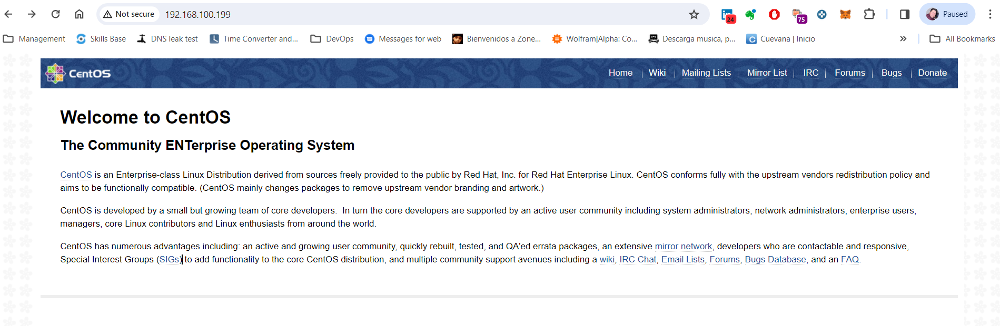
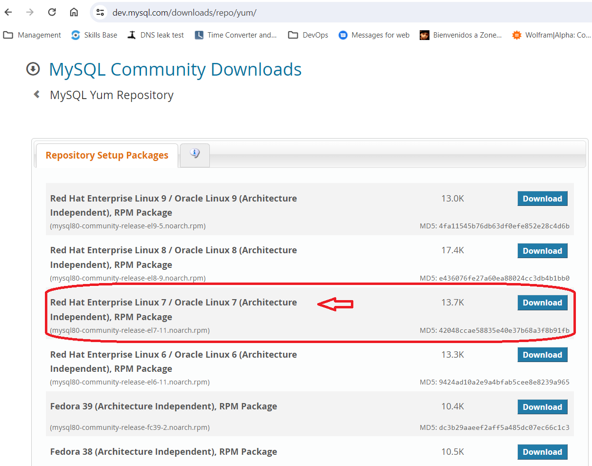
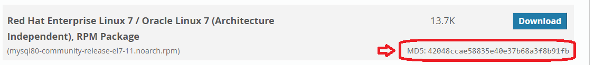

# Instrucciones del laboratorio
Una vez que tengas tu ambiente funcionando deberás crear un par de playbooks, uno para los webservers y otro para los dbservers. Los nodos son Centos7, por lo que deberás investigar los módulos que deberás utilizar para poder lograr hacer las instalaciones requeridas.

A continuación te muestro los requisitos y pasos para la instalación y configuración de cada uno de los roles, que deberás utilizar como guía para traducirlo y crear tus playbooks.

## 1. Crear un playbook para webservers
El playbook deberá instalar nginx, siguiendo los siguientes pasos:

#### Step 1 — Adding the EPEL Software Repository
To add the CentOS 7 EPEL repository, first connect to your CentOS 7 machine via SSH, then use the yum command to install the extended package repository:

```shell
sudo yum install epel-release
```

You’ll be prompted to verify that you want to install the software. Type y then ENTER to continue.

#### Step 2 — Installing Nginx
Now that the EPEL repository is installed on your server, install Nginx using the following yum command:

```shell
sudo yum install nginx
```

Again, answer yes to the verification prompt, then Nginx will finish installing.

#### Step 3 — Starting Nginx
Nginx will not start automatically after it is installed. To get Nginx running, use the systemctl command:

```shell
sudo systemctl start nginx
```

You can check the status of the service with systemctl status:

```shell
sudo systemctl status nginx
```
_Output:_
```shell
[vagrant@host1 ~]$ sudo systemctl status nginx
● nginx.service - The nginx HTTP and reverse proxy server
   Loaded: loaded (/usr/lib/systemd/system/nginx.service; disabled; vendor preset: disabled)
   Active: active (running) since Thu 2024-04-04 00:11:44 UTC; 10s ago
  Process: 3542 ExecStart=/usr/sbin/nginx (code=exited, status=0/SUCCESS)
  Process: 3540 ExecStartPre=/usr/sbin/nginx -t (code=exited, status=0/SUCCESS)
  Process: 3539 ExecStartPre=/usr/bin/rm -f /run/nginx.pid (code=exited, status=0/SUCCESS)
 Main PID: 3544 (nginx)
   CGroup: /system.slice/nginx.service
           ├─3544 nginx: master process /usr/sbin/nginx
           └─3545 nginx: worker process

Apr 04 00:11:44 host1 systemd[1]: Starting The nginx HTTP and reverse proxy server...
Apr 04 00:11:44 host1 nginx[3540]: nginx: the configuration file /etc/nginx/nginx.conf syntax is ok
Apr 04 00:11:44 host1 nginx[3540]: nginx: configuration file /etc/nginx/nginx.conf test is successful
Apr 04 00:11:44 host1 systemd[1]: Started The nginx HTTP and reverse proxy server.
```
#### Step 4 — Check the URL is up and running
> http://server_domain_name_or_IP/




## 2. Crear un playbook para dbservers
Este playbook deberá instalar una base de datos MySQL, siguiendo los siguientes pasos:


#### Step 1 — Adding the MySQL Yum Repository
In a web browser, visit:

> https://dev.mysql.com/downloads/repo/yum/

Note that the prominent Download links don’t lead directly to the files. Instead, they lead to a subsequent page where you’re invited to log in or sign up for an account. If you don’t want to create an account, you can locate the text “No thanks, just start my download”, then right-click and copy the link location, or you can edit the version number in the commands below.

Locate the desired version, and update it as needed in the link below:



```shell
curl -sSLO https://dev.mysql.com/get/mysql80-community-release-el7-11.noarch.rpm
```

Once the rpm file is saved, we will verify the integrity of the download by running md5sum and comparing it with the corresponding MD5 value listed on the site:

```shell
md5sum mysql80-community-release-el7-11.noarch.rpm
```

_Output:_
```shell
$ md5sum mysql80-community-release-el7-11.noarch.rpm

e2bd920ba15cd3d651c1547661c60c7c  mysql80-community-release-el7-11.noarch.rpm
```

Compare this output with the appropriate MD5 value on the site:



Now that we’ve verified that the file wasn’t corrupted or changed, we’ll install the package:

Install the downloaded release package with the following command:

```shell
sudo yum localinstall mysql80-community-release-el7-11.noarch.rpm
```
_Output:_
```shell
[vagrant@host2 ~]$ sudo yum localinstall mysql80-community-release-el7-11.noarch.rpm
Loaded plugins: fastestmirror
Examining mysql80-community-release-el7-11.noarch.rpm: mysql80-community-release-el7-11.noarch
Marking mysql80-community-release-el7-11.noarch.rpm as an update to mysql80-community-release-el7-5.noarch
Resolving Dependencies
--> Running transaction check
---> Package mysql80-community-release.noarch 0:el7-5 will be updated
---> Package mysql80-community-release.noarch 0:el7-11 will be an update
--> Finished Dependency Resolution

Dependencies Resolved

========================================================================================================================
 Package                           Arch           Version        Repository                                        Size
========================================================================================================================
Updating:
 mysql80-community-release         noarch         el7-11         /mysql80-community-release-el7-11.noarch          17 k

Transaction Summary
========================================================================================================================
Upgrade  1 Package

Total size: 17 k
Is this ok [y/d/N]: y
Downloading packages:
Running transaction check
Running transaction test
Transaction test succeeded
Running transaction
Warning: RPMDB altered outside of yum.
  Updating   : mysql80-community-release-el7-11.noarch                                                              1/2
  Cleanup    : mysql80-community-release-el7-5.noarch                                                               2/2
  Verifying  : mysql80-community-release-el7-11.noarch                                                              1/2
  Verifying  : mysql80-community-release-el7-5.noarch                                                               2/2

Updated:
  mysql80-community-release.noarch 0:el7-11

Complete!
```

#### Step 2 — Installing MySQL

We can now use them to install MySQL server:

```shell
sudo yum install mysql-server
```

Press y to confirm that you want to proceed. Since we’ve just added the package, we’ll also be prompted to accept its GPG key. Press y to download it and complete the install.

#### Step 3 — Starting MySQL

We’ll start the daemon with the following command:

```shell
sudo systemctl start mysqld
```
systemctl doesn’t display the outcome of all service management commands, so to be sure we succeeded, we’ll use the following command:

```shell
sudo systemctl status mysqld
```

If MySQL has successfully started, the output should contain Active: active (running) and the final line should look something like:

_Output:_
```shell
[vagrant@host2 ~]$ sudo systemctl status mysqld

● mysqld.service - MySQL Server
   Loaded: loaded (/usr/lib/systemd/system/mysqld.service; enabled; vendor preset: disabled)
   Active: active (running) since Thu 2024-04-04 01:09:51 UTC; 19s ago
     Docs: man:mysqld(8)
           http://dev.mysql.com/doc/refman/en/using-systemd.html
  Process: 3618 ExecStartPre=/usr/bin/mysqld_pre_systemd (code=exited, status=0/SUCCESS)
 Main PID: 3685 (mysqld)
   Status: "Server is operational"
   CGroup: /system.slice/mysqld.service
           └─3685 /usr/sbin/mysqld

Apr 04 01:09:04 host2 systemd[1]: Starting MySQL Server...
Apr 04 01:09:51 host2 systemd[1]: Started MySQL Server.
```

#### Step 4 — Configuring MySQL
During the installation process, a temporary password is generated for the MySQL root user. Locate it in the mysqld.log with this command:

```shell
sudo grep 'temporary password' /var/log/mysqld.log
```

_Output:_
```shell
[vagrant@host2 ~]$ sudo grep 'temporary password' /var/log/mysqld.log

2024-04-04T01:09:17.020301Z 6 [Note] [MY-010454] [Server] A temporary password is generated for root@localhost: lKJ&&at=y4h,
```

MySQL includes a security script to change some of the less secure default options for things like remote root logins and sample users.

Use this command to run the security script.

```shell
sudo mysql_secure_installation
```

This will prompt you for the default root password. As soon as you enter it, you will be required to change it.

_Output:_
```shell
[vagrant@host2 ~]$ sudo mysql_secure_installation

Securing the MySQL server deployment.

Enter password for user root:

The existing password for the user account root has expired. Please set a new password.

New password:
```
Enter a new 12-character password that contains at least one uppercase letter, one lowercase letter, one number and one special character. Re-enter it when prompted.

You’ll receive feedback on the strength of your new password, and then you’ll be immediately prompted to change it again. Since you just did, you can confidently say No:


## Entrega
La entrega será a través de la plataforma de Canvas, y deberás subir cada uno de tus playbooks.